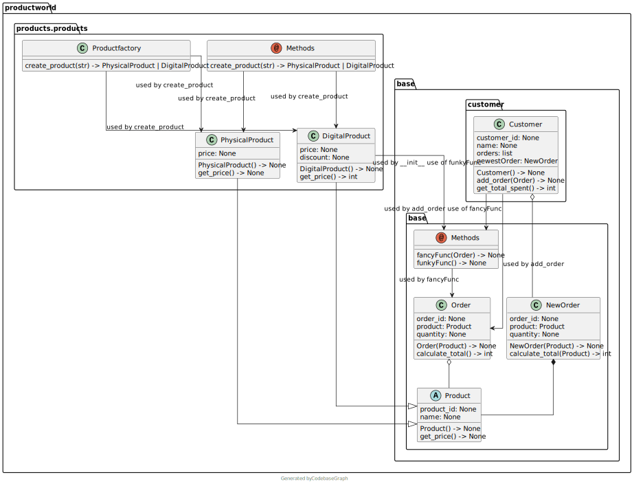

# Py2Graph: a graph based mod of Py2puml to reveal code complexity

This software is inspired by Py2Puml. I was not entirely satisfied with the results of 
my [pypuml mod](https://github.com/dolind/py2puml).

I redid much of the parser and change the whole datastructures to a graph.

The tool discards strict UML Syntax and focuses on highlighting all dependencies, including free functions.
Calls and usages within function body are registered.
Real complexity usually stems from these hidden connections.

More details for my motivation can be found on my
[blog](http://www.storymelange.com/posts/projects/uml-analyser/do-you-know-the-hidden-paths-of-your-code.html).

## Usage
Run as module

Working directory must be module path.

Parameters: 
- module path is the path to the directory of the module directory.
- module name is the module name

## Example
A bigger example was added to evaluate the documentation of methods and dependencies in class methods.

Run `python -m py2graph example/productworld productworld`.

The result shows the correct documentation of methods and free functions, now with the usage of the free functions,
compared to my [pypuml mod](https://github.com/dolind/py2puml).

## Live-app

I wanted a quick demo feature how changes to the source code should be directly visible in the Model.

The app's architecture:

Run `start_plantuml_docker.sh`. Then run `main.py`. 

Provide the full path to your python module in the text field.
